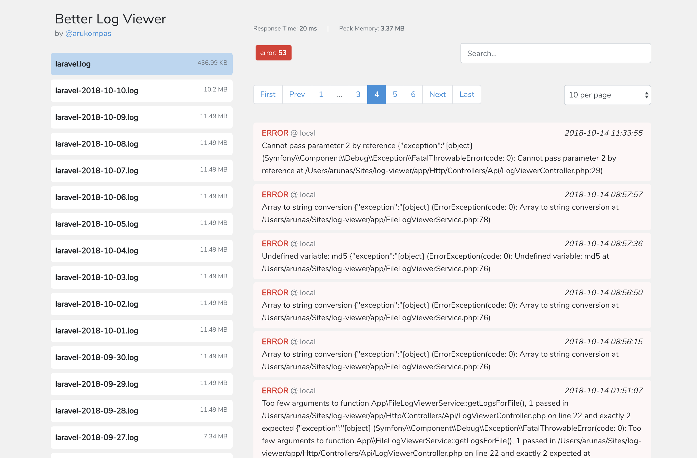

[](https://packagist.org/packages/arukompas/better-log-viewer)
[](https://packagist.org/packages/arukompas/better-log-viewer)
[](https://packagist.org/packages/arukompas/better-log-viewer)
[](https://packagist.org/packages/arukompas/better-log-viewer)


# Better Log Viewer

Better Log Viewer is a Laravel package for viewing your Laravel logs in a clean and intuitive web interface.

**Supports all Laravel 5, Laravel 6, Laravel 7 and Laravel 8 versions.**





## Installation

### 1. Require the package

```
composer require arukompas/better-log-viewer
```

### 2. (Laravel 5.4 and older only) - Provider

Add the service provider to your `config/app.php` configuration's `'providers'` array:

```
Arukompas\BetterLogViewer\BetterLogViewerProvider::class,
```

### 3. (optional) Publish the config

You can publish the config using this artisan command:
```
php artisan vendor:publish --tag=config
```

### 4. Visit `<your-app-url>/log-viewer`

## Configuration

You can configure the middleware and the route for the log viewer in the `config/better-log-viewer.php` file which was previously copied over by the vendor publish command.
